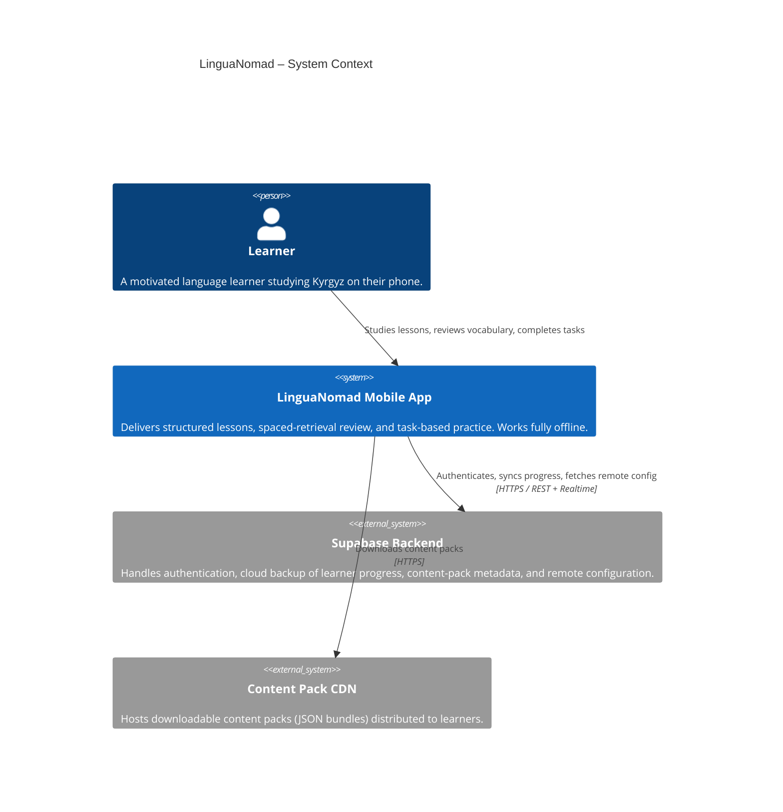
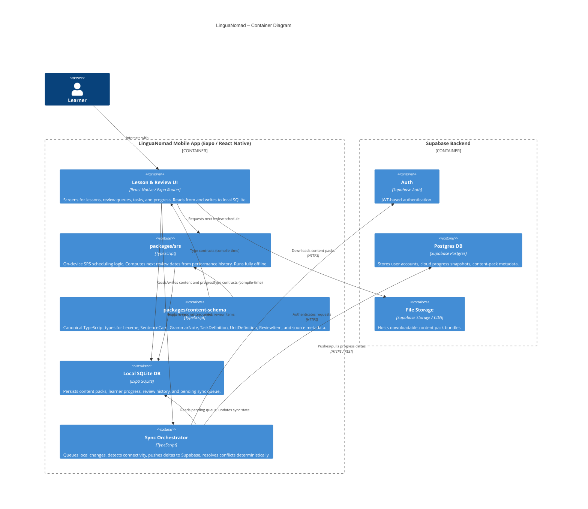
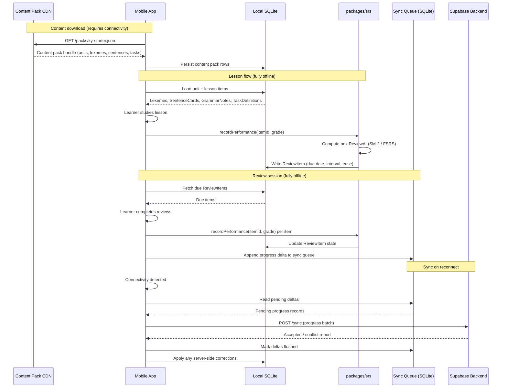
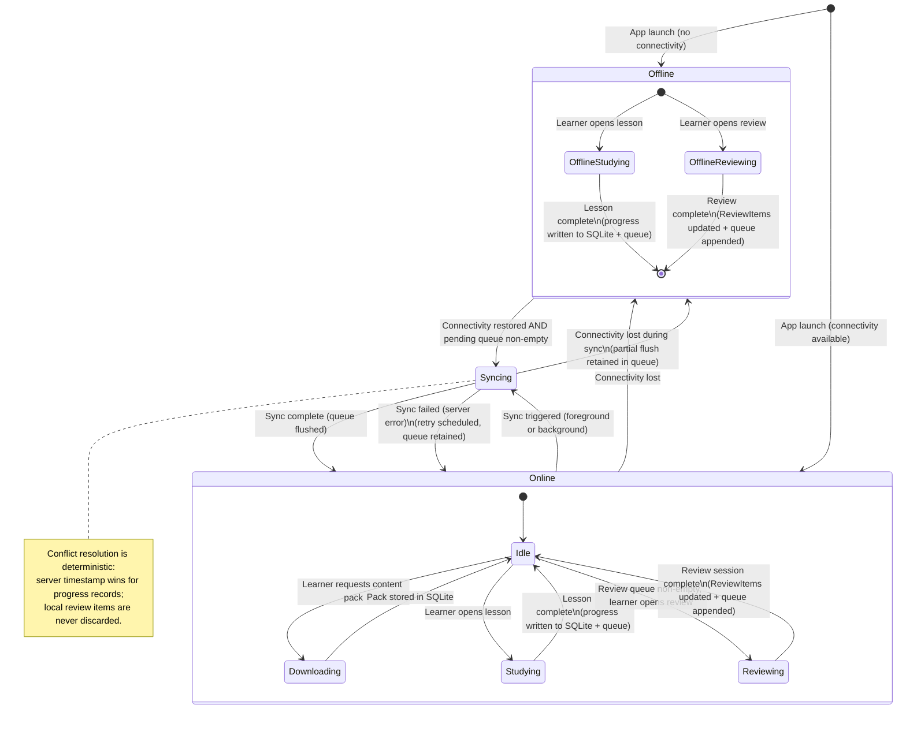
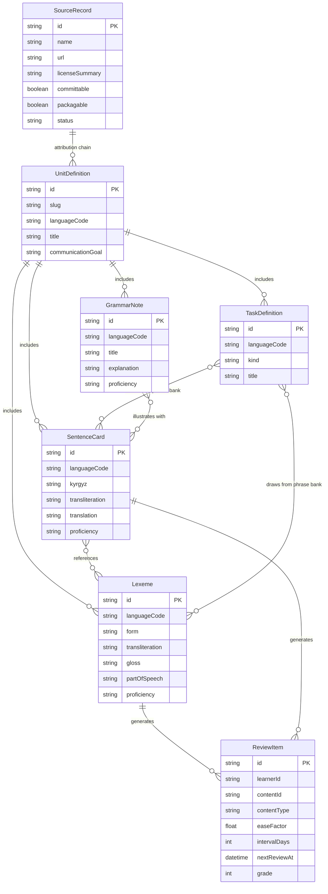

# LinguaNomad Architecture Diagrams

This document contains Mermaid diagrams across five views of the LinguaNomad system.

---

## 1. System Context Diagram (C4 Level 1)

Who uses the system and what external systems does it depend on?

---

## 2. Container Diagram (C4 Level 2)

Major containers inside the mobile app and how they connect to the backend.

---

## 3. Data Flow: Content Pack → Lesson → SRS → Sync

End-to-end journey of content from CDN download to reviewed and synced progress.

---

## 4. Offline-First State Machine

The app transitions between online, offline, and syncing states.

---

## 5. Content Model ER Diagram

Relationships between the core content and review entities in `packages/content-schema`.

